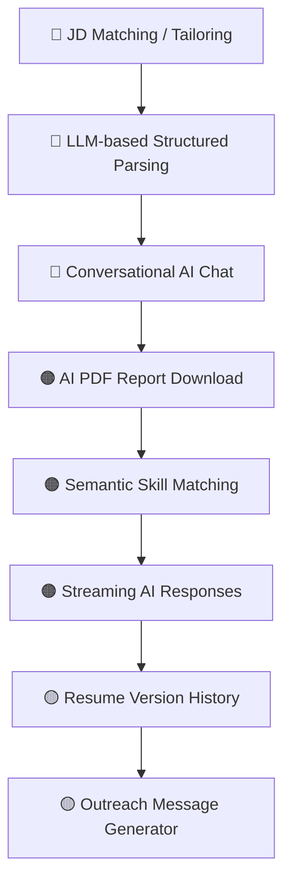

# 🧠 GenAI Gap Analysis — Smart AI Resume Analyzer

## What the Project Currently Does Well ✅

| Area | Status |
|------|--------|
| Groq LLM integration (via OpenAI-compatible API) | ✅ Done |
| AI-powered resume scoring & keyword analysis | ✅ Done |
| AI bullet point & summary generation | ✅ Done |
| AI cover letter generation | ✅ Done |
| AI mock interview question generation | ✅ Done |
| ATS score calculation (rule-based) | ✅ Done |
| Resume builder with AI assist | ✅ Done |
| Job search integration | ✅ Done |
| Job Description (JD) matching & tailoring | ✅ Done |
| Conversational AI Chat (RAG Resume Memory) | ✅ Done |

---

## 🚨 What is Missing (GenAI Perspective)

### 🔴 Critical Gaps

#### 1. **No Job Description (JD) Matching / Tailoring** (✅ Implemented)
> **The biggest missing feature for a GenAI resume tool.**

Currently implemented as a dedicated tab under Resume Analyzer with real-time Groq LLM comparison, match percentage, skill gap breakdown, and tailored rewrites.

---

#### 2. **No Retrieval-Augmented Generation (RAG) / Resume Memory** (✅ Implemented)
> **Conversational AI Chat Interface with Resume RAG Memory.**

Now implemented under the **"Conversational AI Chat"** tab in Resume Analyzer. Holds full candidate resume text, target role, JD context, and previous analysis scores in memory, streaming real-time AI responses to multi-turn follow-up queries.

---

#### 3. **Semantic Skill Matching (Embeddings)** (✅ Implemented)
The current keyword matching is **string-based** (`if skill in text`). This means:
- `"ML"` won't match `"Machine Learning"`
- `"React.js"` won't match `"ReactJS"`
- `"GenAI"` won't match `"Generative AI"`

Implemented in `utils/resume_analyzer.py` with lazy `sentence-transformers` embeddings (`all-MiniLM-L6-v2`) and a deterministic alias fallback for common skill spellings. Exact matching remains the fast path, while semantic matches are compared against resume sentences using cosine similarity.

---

### 🟠 High-Impact Missing Features

#### 4. **AI PDF Report Generation** (✅ Implemented)
The README mentions *"AI-Powered Resume Score with Detailed PDF Report"* (Version 2.0 feature) but this is **not implemented**. Users get on-screen feedback only — there's no downloadable AI report PDF.

Implemented with `reportlab` in `utils/pdf_report.py` and exposed beside the analysis score cards as a downloadable PDF. The report includes the AI score and verdict, summary, strengths, weaknesses, keyword coverage, section feedback, action plan, and AI bullet rewrites.

---

#### 5. **Multi-Model / Model Selection Support** (✅ Implemented)
The app is locked to a single Groq model (`llama3-8b-8192`). There's no way for users to:
- Switch between models (e.g., `llama3-70b`, `mixtral`, `gemma`)
- See a comparison of outputs between models

Implemented with a model selector on the Resume Analyzer page. The selected model is used for role analysis, JD matching, generated content, and conversational chat. Users can also run a side-by-side comparison against another configured model. `GROQ_MODEL` remains the default, while `GROQ_MODELS` controls the selectable model list.

---

#### 6. **AI-Powered Resume Parsing (Structured Extraction)** (✅ Implemented)
The `resume_parser.py` is only 2KB — it's essentially a stub. The actual parsing in `resume_analyzer.py` is **pure regex-based**. For a GenAI project, this is a major weakness:
- It fails on non-standard resume formats
- It cannot distinguish companies, roles, dates robustly
- Structured parsing (name, company, title, date, description) is not extracted

Implemented with a strict Groq JSON extraction step for personal information, summary, education, experience, skills, and projects. The normalized profile feeds the existing analysis and persistence flow, while the current regex extraction remains a field-level fallback when Groq returns invalid JSON or is unavailable.

```python
# Prompt: "Extract this resume into a structured JSON with fields: 
#  name, email, phone, education, experience, skills, projects"
```

---

#### 7. **No LinkedIn Profile URL Analysis**
The app collects LinkedIn URLs but does nothing with them. A modern GenAI resume tool should:
- Allow LinkedIn profile import (scraping or copy-paste of profile text)
- Compare LinkedIn data vs. resume for consistency gaps

---

#### 8. **No Streaming / Real-Time AI Response**
All Groq calls are blocking — the user stares at a spinner. The Groq API supports **streaming**, which would make the experience feel much faster and more like ChatGPT.

**What to add:**
```python
# Use stream=True in the Groq API call
# Use st.write_stream() in Streamlit
```

---

### 🟡 Medium-Impact Missing Features

#### 9. **No Resume Version History / A-B Testing**
Users can't:
- Save multiple versions of their resume
- Compare Score A (before AI suggestions) vs. Score B (after applying them)
- Track improvement over time

---

#### 10. **No AI-Powered "Cold Outreach" Message Generator**
Given that users are already in job-search mode, an LLM can generate:
- LinkedIn connection request messages
- Cold email templates to recruiters
- Referral request messages

---

#### 11. **No Multilingual Resume Support**
The app is English-only. Groq (LLaMA 3) supports many languages, so adding multilingual analysis would be a significant differentiator.

---

#### 12. **No Confidence / Hallucination Guardrails**
The AI output (from Groq) is displayed directly with no:
- Confidence scoring
- Source citation (which line of the resume triggered the feedback)
- Fallback handling for hallucinated skills

---

## 🗺️ Recommended Priority Roadmap



| Priority | Feature | Effort | Impact |
|----------|---------|--------|--------|
| 🔴 P0 | JD-based Resume Tailoring | Medium | 🚀 Very High |
| 🔴 P0 | LLM Structured Resume Parsing | Low | High |
| 🔴 P0 | Conversational AI Chat (Resume Q&A) | Medium | 🚀 Very High |
| 🟠 P1 | AI PDF Report Download | Medium | High |
| 🟠 P1 | Semantic Skill Matching (Embeddings) | Medium | High |
| 🟠 P1 | Streaming AI Responses | Low | Medium |
| 🟡 P2 | Resume Version A/B Comparison | High | Medium |
| 🟡 P2 | Cold Outreach Message Generator | Low | Medium |
| 🟡 P2 | Multilingual Support | Low | Medium |

---

## 💡 Quick Win Recommendation

The **fastest, highest-impact** thing to add is **JD Matching** — paste a job description, compare against your resume, get a tailored score and keyword gap. This is the #1 feature users of resume tools expect and it's a genuine GenAI use case that showcases LLM power far better than the current rule-based scoring.
